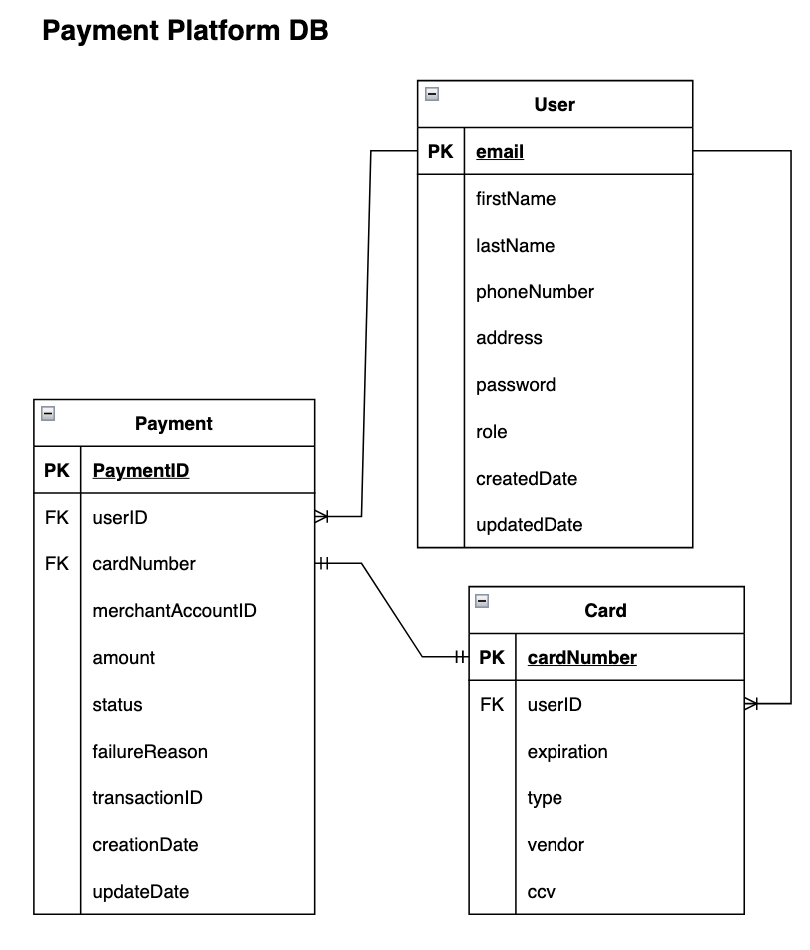
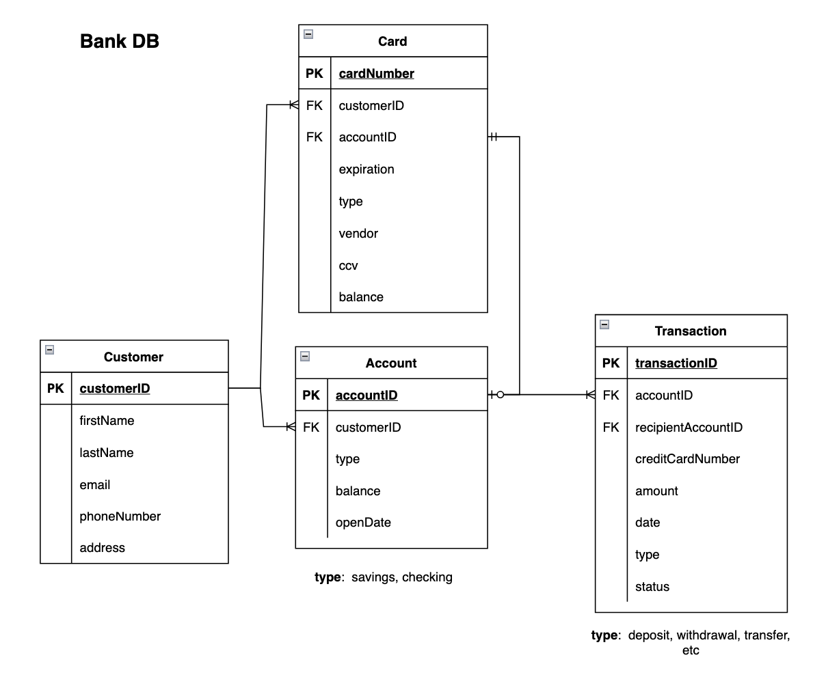

# Online payment platform
With the rapid expansion of e-commerce, there is a pressing need for an efficient payment gateway. This project aims to develop an online payment platform, which will be an API-based application enabling e-commerce businesses to securely and seamlessly process transactions.
Entities Involved:
1. **Customer**: Individuals who make online purchases and complete payments through the platform.
2. **Merchant**: The seller who utilizes the payment platform to receive payments from customers.
3. **Online Payment Platform**: An application that validates requests, stores card information, and manages payment requests and responses to and from the acquiring bank.
4. **Acquiring Bank**: Facilitates the actual retrieval of funds from the customer's card and transfers them to the merchant. Additionally, it validates card information and sends payment details to the relevant processing organization.

---
* [Setup](#setup)
  * [Prerequisites](#prerequisites)
  * [Running the application](#running-the-application)
* [Use of the API](#use-of-the-api)
* [Structure](#structure)
  * [Database diagram - Payment platform](#database-diagram---payment-platform)
  * [Database diagram - Acquiring bank](#database-diagram---acquiring-bank)
* [Design decisions and assumptions](#design-decisions-and-assumptions)
* [Cloud technologies](#cloud-technologies)
---

## Setup
### Prerequisites
- Go
- SQLite, specifically the `sqlite3` command-line tool, is required to run the application.
---
### Running the application
1. Clone the repository.
2. Navigate to the root directory of the project.
3. Run the following command to setup the application:
   ```bash
   make prepare
   ```
   This will install all the Go required dependencies, and will also create the database and populate it. 
4. Run the following command to start the payment platform application:
   ```bash
   make start-app
   ```
   This will start the application on port 8080.
5. Run the following command to start the acquiring bank application:
   ```bash
   make start-bank
   ```
   This will start the acquiring bank application on port 8081.
6. The application is now running and can be accessed via the following URL: `http://localhost:8080`.
7. Before making any request, you must first authenticate using the `/login` endpoint. You may use any of the users that appear on the `create_database_tables.sql` file. The password for all the users is `1234`.

## Use of the API

- `POST /signup`: This endpoint is used to create a new user. It requires a JSON body with the following structure:
  ```json
  {
    "email": "test@mail.com",
    "password": "1234",
    "role": "customer",
    "firstName": "Joel",
    "lastName": "Fabian",
    "phoneNumber": "+285246321",
    "address": "Main street 1001"
  }
  ```
    The `role` field can be either `customer` or `merchant`.


- `POST /login`: This endpoint is used to log in a user. It requires a JSON body with the following structure:
  ```json
  {
    "email": "1@mail.com",
    "password": "1234"
  }
  ```
- `POST /payments`: This endpoint is used to create a payment. Note that the payment will not be processed until the corresponding merchant makes the request to do so. It requires a JSON body with the following structure:
  ```json
  {
    "amount": 500,
    "merchantAccountID": "5",  
    "userID": "2@mail.com", 
    "cardNumber": 7048506547895036
  }
  ```
    - `merchantAccountID`: The account of the merchant to which the payment is made
    - `userID`: The email of the customer making the payment


- `GET /payments/{paymentID}`: This endpoint is used to retrieve a payment. It requires the `paymentID` as a path parameter.
- `POST /payments/process`: This endpoint is used to process a payment. The application will only process the first payment of the queue that matches the `merchantAccountID`. It requires a JSON body with the following structure:
  ```json
  {
    "merchantAccountID": "5"
  }
  ```
- `POST /refund`: This endpoint is used to refund a payment. When a payment is processed, it will be updated to include the ID of the transaction made to transfer the funds from the customer to the merchant. This ID is the one that will be required to revert the transaction in case of refund. This endpoint requires a JSON body with the following structure:
  ```json
  {
    "transactionID": "qo8hD3ApAQwDHn3"
  }
  ```
- `POST /card`: This endpoint is used to register a card to the application. The customer will need to register a card if when making a payment, the application detects that the passed in card is not registered. It requires a JSON body with the following structure:
  ```json
  {
    "cardNumber": 1654720058763025,
    "customerID": "1",
    "expiration": "12/28",
    "ccv": 123,
    "type": "credit",
    "vendor": "Visa"
  }
  ```
## Structure
The application is divided into two main services: the payment platform and the acquiring bank. A user will only interact with the payment platform. The payment platform will then interact with the acquiring bank to process the payment via the API that the bank exposes.
### Database diagram - Payment platform


### Database diagram - Acquiring bank



## Design decisions and assumptions
- A payment must have a customer and a merchant. When a customer makes a payment, it is to a specific merchant. 
  - It is assumed that when a merchant publishes a product, they add the account to which they want the funds to go once a customer purchases the product. For this reason, when making a payment, the `merchantAccountID` for which it is made must be specified. 
  - A payment is made with a card previously registered in the application. This means that to make a payment with a new card, the customer must first add it by making a POST to the `/card` endpoint. 
- The cards that the user adds to the application are existing cards, that is, it is assumed that the customer already created an account and obtained their card from the bank, so that entity has a database with cards and accounts. 
- If the card used to make a payment is a debit card, the funds will be deducted from the customer's account at the bank; if the card is a credit card, the funds will be deducted from the customer's card at the bank. This is why cards that have a "balance" are credit cards, while those that only have an associated account are debit cards.

## Cloud technologies
- **AWS Lambda** for both services: the payment platform and the acquiring bank. Lambda is great because it allows for a serverless architecture, which means that the application can be run without the need to manage servers. This is great for scalability and cost reduction. 
  - Lambda supports out of the box integration with Golang, which makes the development process easier.   
  - Lambda integrates with AWS API Gateway in a simple manner, which is a services that facilitates the creation of REST APIs.
- **AWS API Gateway** to create the REST API for the payment platform and the acquiring bank. 
  - API Gateway has a simple and intuitive interface that allows for the creation of APIs in a few steps. 
  - It is possible to setup a lambda authorizer to secure the API. This is a lambda function that intercepts all the requests made to the API and checks if the user is authorized to make the request. In my case, I would use that lambda to check for the access tokens and validate them.
  - It integrates with AWS Lambda, which makes the process of creating an API easier.
- **AWS RDS** to store the data. RDS is a managed relational database service that makes it easy to set up, operate, and scale a relational database in the cloud. The fact that I won't have to manually setup the DB and manage it, is the main reason why I would use this service. It also has a generous free tier, which is great for cost reduction.
- **AWS Secrets** I would mainly use this service to store the private and public keys that the server uses to create and validate the JWT tokens. 
  - It integrates with AWS Lambda, which makes it easy to access the secrets from the lambda functions.
- **AWS SQS** to create the queue for the payments. The purpose of using a queue is to decouple the payments made by a customer, from the processing made by a merchant. I would use SQS because:
  - Easy integration with AWS Lambda.
  - Is an external service, meaning that in the case the application fails, the payment will not be lost and can be processed later. 
  